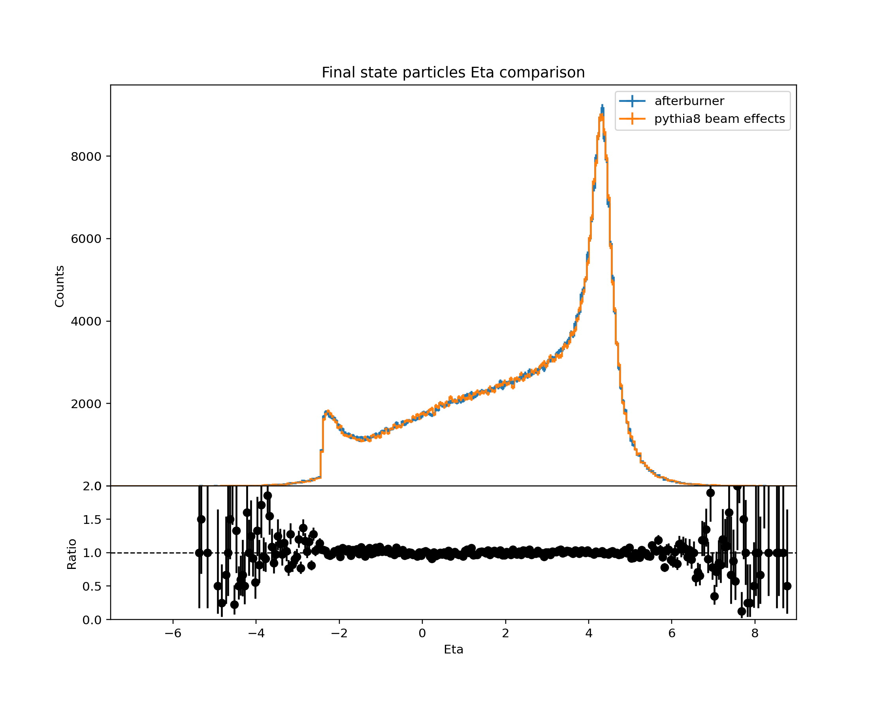
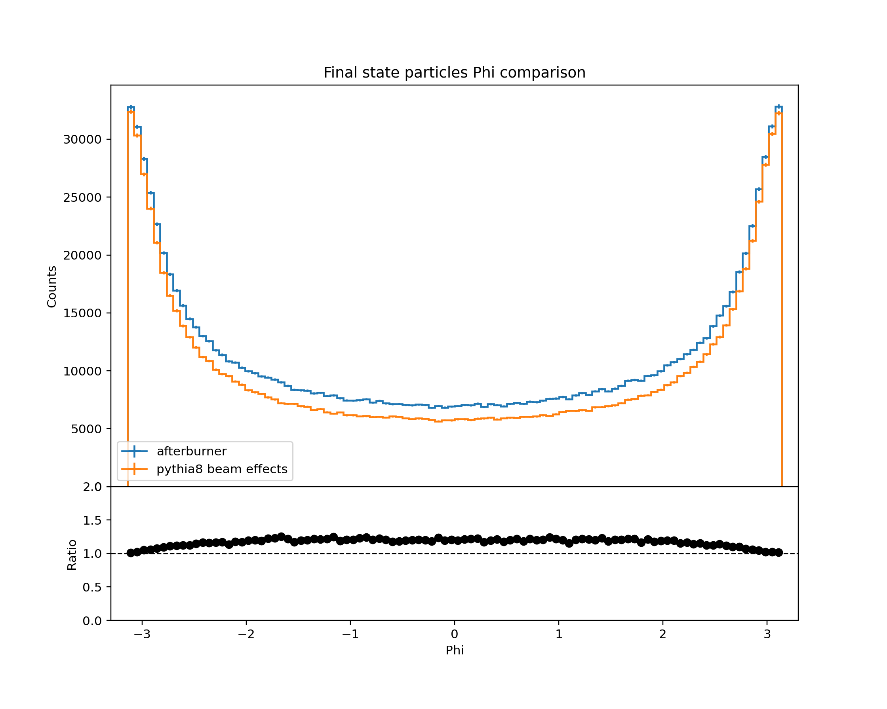
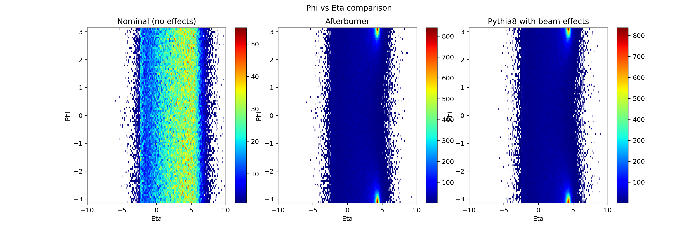
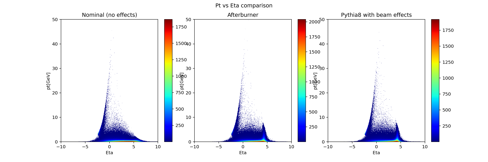

# afterburner

EIC MC afterburner

The converter and benchmark require libyaml-cpp. Those are available in package managers for the most of systems:

```bash 
apt install libyaml-cpp-dev     # Debian/Ubuntu/Mint
yum install yaml-cpp-devel      # RHEL/CentOS/Fedora
```

To apply benchmarks one could go 

https://dtn01.sdcc.bnl.gov:9000/minio/eictest/ATHENA/WG/BeamEffects/

## Building

```bash
git clone https://eicweb.phy.anl.gov/monte_carlo/afterburner.git
mkdir -p afterburner/build
cd afterburner/build

# setup cmake (c++ code lives in cpp directory) 
cmake ../cpp

# to build all
cmake --build ../cpp --target all

# to install
cmake --build ../cpp --target install -- -j 8
```

## Validation

The validation plots are generated and can be viewed in [python/comparison.ipynb](python/comparison.ipynb)

<br/>
<br/>
<br/>
<br/>


