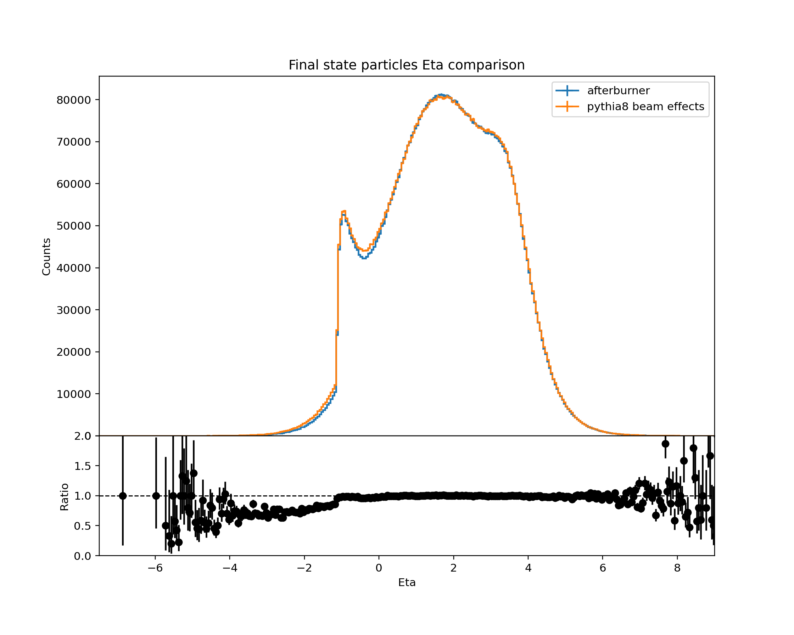
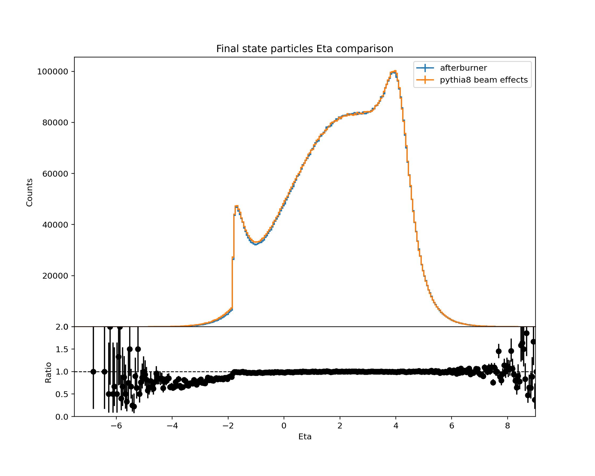
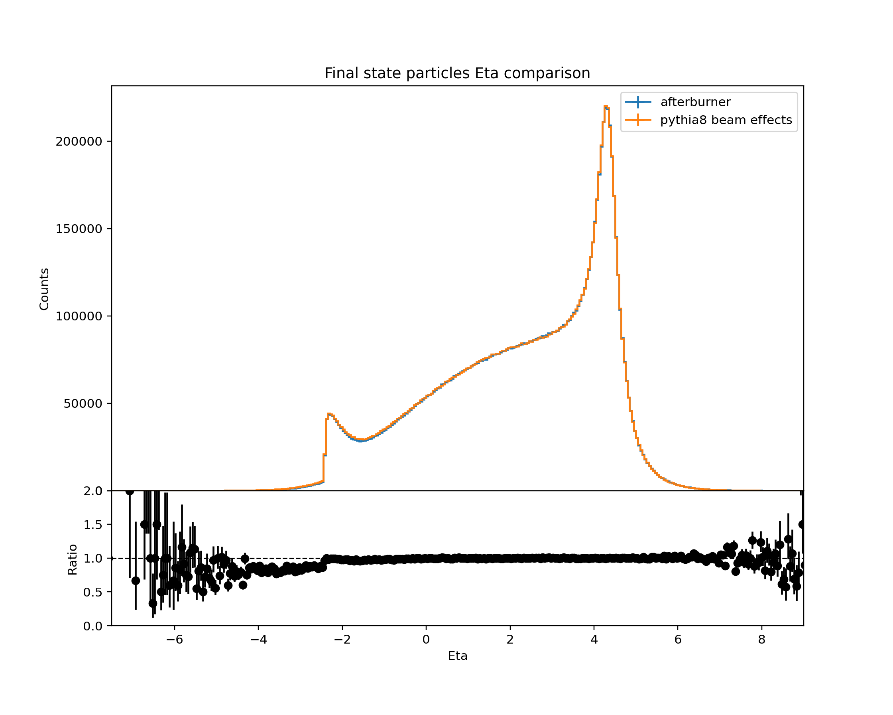
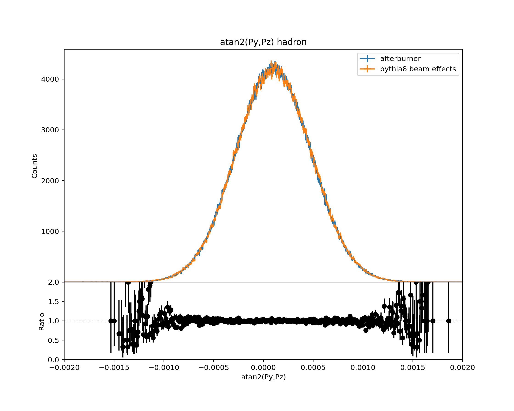
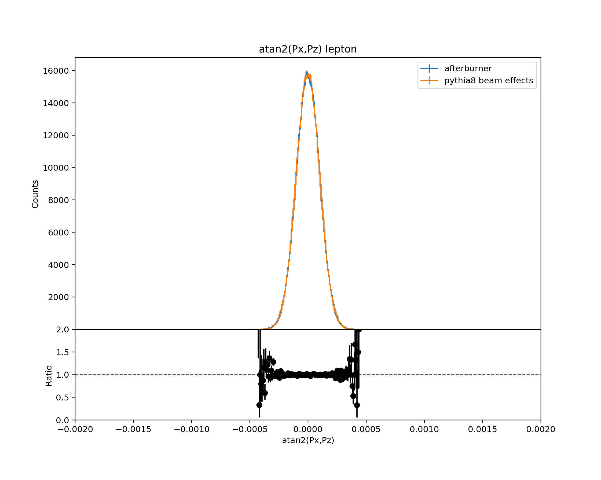
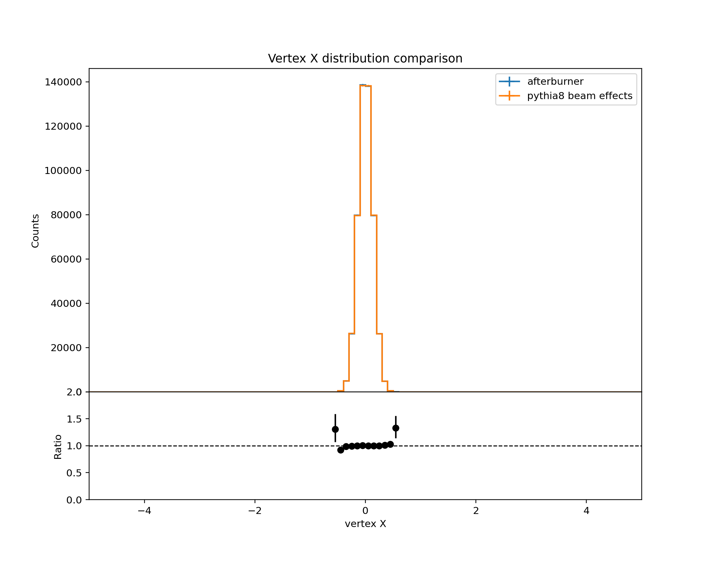
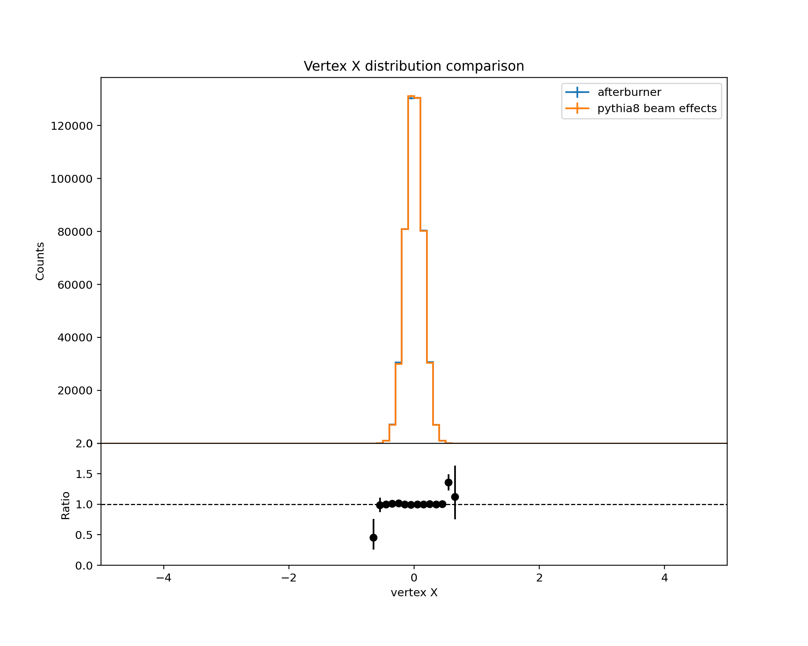
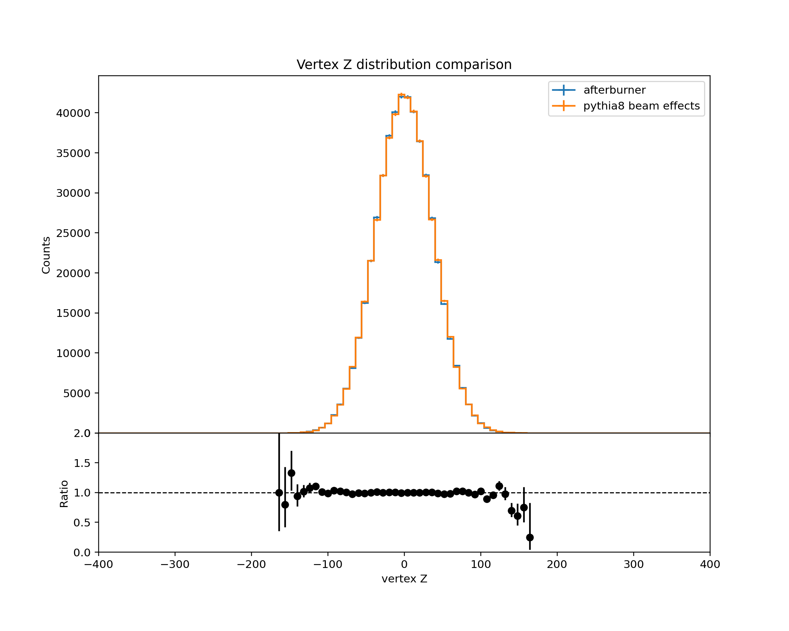
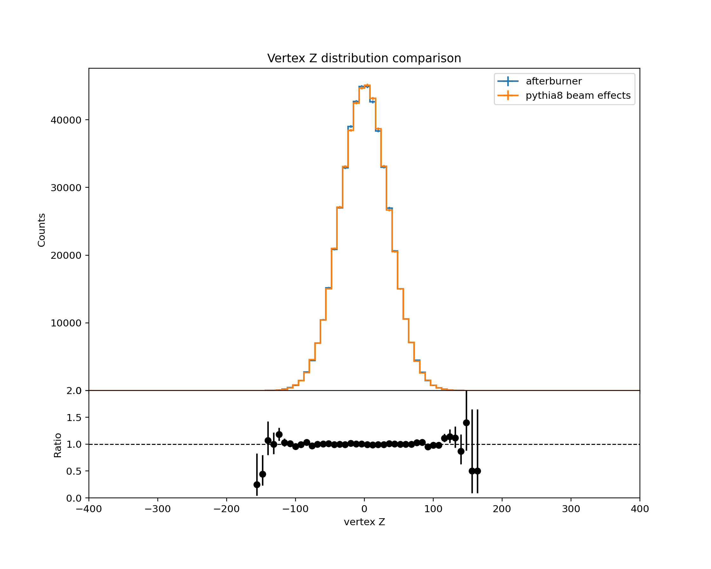

# afterburner

EIC MC afterburner. Software package to provide framework independent
well validated crossing angle and beam effects C++ library and HepMC file converter (abconv) 
for Electron Ion Collider. 

**Physics simulated:**
- Crossing angle
- Beam effects (divergence, crabbing kick, etc.)
- Vertex spread (position, time)


**Software:**
- Standalone framework independent code
- Clean C++ API to embed in analysis scripts and/or frameworks
- Convenient Command Line Interface (CLI) HepMC2/3 and `root.hepmc` converter, that adds crossing_angle_hor and beam effects
- Configurable beam parameters interface (yaml files)


## Installation

The converter and benchmark require libyaml-cpp. Those are available in package managers for the most of systems:

```bash 
apt install libyaml-cpp-dev     # Debian/Ubuntu/Mint
yum install yaml-cpp-devel      # RHEL/CentOS/Fedora
```


```bash
git clone https://eicweb.phy.anl.gov/monte_carlo/afterburner.git
mkdir -p afterburner/build
cd afterburner/build

# setup cmake (c++ code lives in cpp directory) 
cmake ../cpp

# to build all
cmake --build ../cpp --target all

# to install
cmake --build ../cpp --target install -- -j 8
```

**Preinstalled versions** are available in [ATHENA containers](https://doc.athena-eic.org/en/latest/overview/containers.html). 


## CLI command

### Examples:

```bash
# Process my whole file, add crossing angle, beam effects, do validation plots
abconv my.hepmc

# Same, but limit the number of events to 1000 and set the output name as 'test'
abconv my.hepmc -o test -l 1000

# Just convert hepmc3 to hepmc2 don't use afterburner, don't create plots
abconv my.hepmc -f hepmc2 --ab-off --plot-off 

# Just convert hepmc3 to hepmc.root don't use afterburner, don't create plots
abconv my.hepmc -f treeroot --ab-off --plot-off 
```
Note: In the final example above, you want the `treeroot` option. The `root` option creates a (rather strange) flat file.

How exactly the afterburner works illustrated by `abconv my.hepmc` command. 


### Afterburner algorithm

1. AB opens the input file, gets beam particles and extract beam energy settings (from the first event). 
   See **beam energy settings** for the details below.

2. AB awaits that there is no crossing angle between beam particles. To check this 
   AB calculates a crossing angle between the beam particles. If the crossing angle is not zero
   and `--exit-ca` flag is set - AB exits; without the flag a warning is issued.

3. AB processes events applying crossing angle and beam effects for each event. 
   `-s,--ev-start`, `-e,--ev-end`, `-l,--limit` flags limit the number of events to process

4. By defaults AB also creates *.hist.root file that contains validation histograms  
   `--plot-off` flag can switch off histograms creation


P.S. Is one needs just HepMC3->HepMC2 converter one can use `--ab-off` flag to disable 
afterburner during conversion. This way **abconv** could be use as different HepMC formats
converter.


### Beam energy settings

- The input file events must have two beam particles (marked by status code 4)
- Beam particle energies should correspond to one of EIC beam energy setups:
  - ep \[GeV\]: 275x18, 275x10, 100x10, 100x5, 41x5
  - eAu \[GeV\]: 110x18, 110x10, 110x5, 41x5
- One can [the exact beam parameters](https://eicweb.phy.anl.gov/monte_carlo/afterburner/-/blob/main/cpp/afterburner/EicConfigurator.cc)
  that correspond to EIC CDR tables 3.3, 3.4, 3.5
- Using `-p/--preset` flag one can select a profile:
  - 0: IP6 High Divergence (higher luminosity) - default,
  - 1: IP6 High Acceptance
  - 2: IP6 eAu
  - 3: IP8 High Divergence (higher luminosity) - default,
  - 4: IP8 High Acceptance
  - 5: IP8 eAu
- Crossing angle is given in horizontal and vertical components
  - [Afterburner configuration](https://eicweb.phy.anl.gov/monte_carlo/afterburner/-/blob/main/cpp/afterburner/AfterburnerConfig.hh)
  
> (!) For now IP8 is a copy of IP6 parameters with 35 mrad crossing angle. It will be populated with IP8 own parameters as 
> soon as they are officially published.

### Input file requirements

- The CLI command can accept any file, that HepMC3 library can open:
  HepMC3 ascii, HepMC2 ascii, HepMC3 ROOT, HepEvt etc. 
- The input file events must have two beam particles (marked by status code 4)
- Input file should not have crossing angle and beam effects that AB simulates.
  **By default, it is not possible to apply just crossing angle or just beam effects.**
  **But!** in the upcoming version one can provide beam parameters through yaml config files,
  where one would be able to switch off crossing angle, beam effects, etc. 


### All options:

| Flag                 | Description                               |
|----------------------|-------------------------------------------|
| -h,--help            | Print this help message and exit|
| -v,--version         | Shows package version number |
| -o,--output TEXT     | Base name for Output files ((!) no extension)|
| -p,--preset TEXT     | Beams configuration 0: IP6 High divergence\[default\], 1: IP6 High acceptance, 2: IP6 eAu|
| -i,--in-format TEXT  | Input format: auto \[default\], hepmc2, hepmc3, hpe, lhef, gz, treeroot, root|
| -f,--out-format TEXT | Output format: hepmc3 \[default\], hepmc2, dot, none (no events file is saved)|
| -s,--ev-start INT    | Start event index (all previous are skipped)|
| -e,--ev-end INT      | End event index (end processing after this event)|
| -l,--limit UINT      | Limit number of events to process. (Shutdown after this number of parsed events)|
| --ab-off             | No afterburner is applied|
| --plot-off           | Don't produce validation plots|
| --exit-ca            | Check existing crossing angle and exit if CA>1mrad (1) |


> (1) How `--exit-ca` works exactly: when afterburner processes the first event it checks if 
> it has 2 beam particles (fails with non zero code if not) and then calculates their crossing angle
> with the `--exit-ca` is set and crossing angle absolute value is > 1mrad program ends with 0 code.
> This method is very coarse as if in a source file the crossing angle is 0 but all beam effects do exist,
> beam effects will be applied twice

-p,--preset flag, values \[0,1,2,3,4,5\] set config and auto determine energy from source file:

- "0": IP6, High divergence, auto read energy [default],
- "1": IP6, High acceptance, auto read energy
- "2": IP6, eAu, auto read energy
- "3": IP8, High divergence, auto read energy [default],
- "4": IP8, High acceptance, auto read energy
- "5": IP8, eAu, auto read energy

The other options sets energy settings manually, not checking the source file:

<table>
    <tr><td>ip6_hidiv_41x5</td><td>ip6_hidiv_100x5</td><td>ip6_hidiv_100x10</td><td>ip6_hidiv_275x10</td><td>ip6_hidiv_275x18</td></tr>
    <tr><td>ip6_hiacc_41x5</td><td>ip6_hiacc_100x5</td><td>ip6_hiacc_100x10</td><td>ip6_hiacc_275x10</td><td>ip6_hiacc_275x18</td></tr>
    <tr><td>ip6_eau_41x5  </td><td>ip6_eau_110x5  </td><td>ip6_eau_110x10  </td><td>ip6_eau_110x18  </td><td>-</td></tr>
    <tr><td>ip8_hidiv_41x5</td><td>ip8_hidiv_100x5</td><td>ip8_hidiv_100x10</td><td>ip8_hidiv_275x10</td><td>ip8_hidiv_275x18</td></tr>
    <tr><td>ip8_hiacc_41x5</td><td>ip8_hiacc_100x5</td><td>ip8_hiacc_100x10</td><td>ip8_hiacc_275x10</td><td>ip8_hiacc_275x18</td></tr>
    <tr><td>ip8_eau_41x5  </td><td>ip8_eau_110x5  </td><td>ip8_eau_110x10  </td><td>ip8_eau_110x18  </td><td>-</td></tr>
</table>

Example of manual configuration setting:

```bash
abconv -p ip6_hidiv_100x5 source_file.hepmc
``` 

> (!) For now IP8 is a copy of IP6 parameters with 35 mrad crossing angle. It will be populated with IP8 own parameters as
> soon as they are officially published.
> 

## Validation

The validation is performed by comparison of the resulting particle distributions with
[Pythia8 beam effects](https://github.com/bspage912/eicSimuBeamEffects) simulation. 
The later was also validated with Fun4All afterburner implementation. 


To apply benchmarks. Head-on data (no crossing angle nor effects) is located:

```
https://eics3.sdcc.bnl.gov:9000/minio/eictest/ATHENA/WG/BeamEffects/
```

The validation plots are generated and can be viewed in [python/comparison.ipynb](python/comparison.ipynb)

Essential plots from the latest validation run: 

> The discrepancy in low Eta has been explained by a slight phase space difference
> in generated headon and full beam effects files on Pythia8 side. 
> TL;DR; [It is Fine](https://cdn.vox-cdn.com/thumbor/qQPUPBlaiVYrsXg5QM1QQYVgH34=/0x0:900x500/1400x1400/filters:focal(378x178:522x322):format(jpeg)/cdn.vox-cdn.com/uploads/chorus_image/image/49493993/this-is-fine.0.jpg)

<table>
  <thead>
    <tr>
      <th>41x5 GeV</th>
      <th>100x10 GeV</th>
      <th>275x18 GeV</th>
    </tr>
  </thead>
  <tr>
    <td></td>
    <td></td>
    <td></td>
  </tr>
  <tr>
    <td></td>
    <td></td>
    <td></td>
  </tr>
  <tr>
    <td></td>
    <td></td>
    <td></td>
  </tr>
  <tr>
    <td></td>
    <td></td>
    <td></td>
  </tr>
  <tr>
    <td></td>
    <td></td>
    <td></td>
  </tr>
  <tr>
    <td></td>
    <td></td>
    <td></td>
  </tr>
  <tr>
    <td></td>
    <td></td>
    <td></td>
  </tr>
  <tr>
    <td></td>
    <td></td>
    <td></td>
  </tr>
<tr>
    <td></td>
    <td></td>
    <td></td>
  </tr>
</table>

## References

- [Accelerator and beam conditions critical for physics and detector simulations for the Electron-Ion Collider](https://github.com/eic/documents/blob/master/reports/general/Note-Simulations-BeamEffects.pdf)
- [Pythia8 beam effects](https://github.com/bspage912/eicSimuBeamEffects/blob/headonTestJin/Pythia8/PythiaBeamShape.cxx)
- [Fun4All code](https://github.com/sPHENIX-Collaboration/coresoftware/pull/1251)
